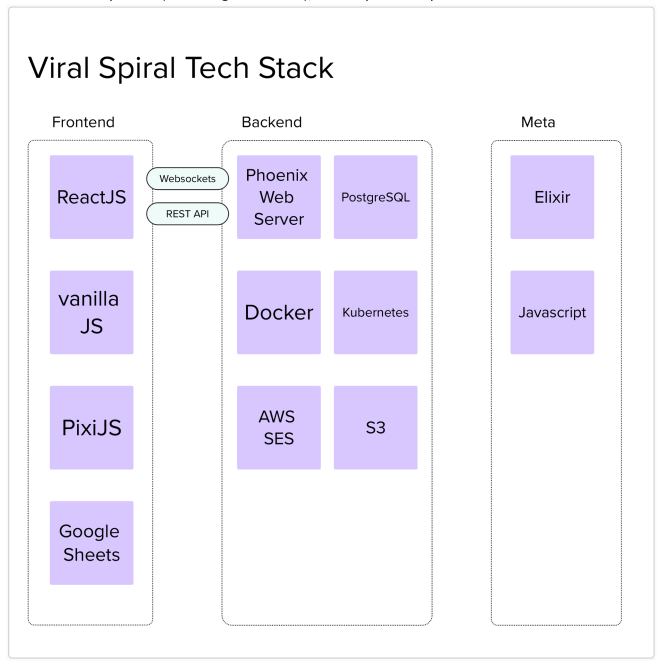
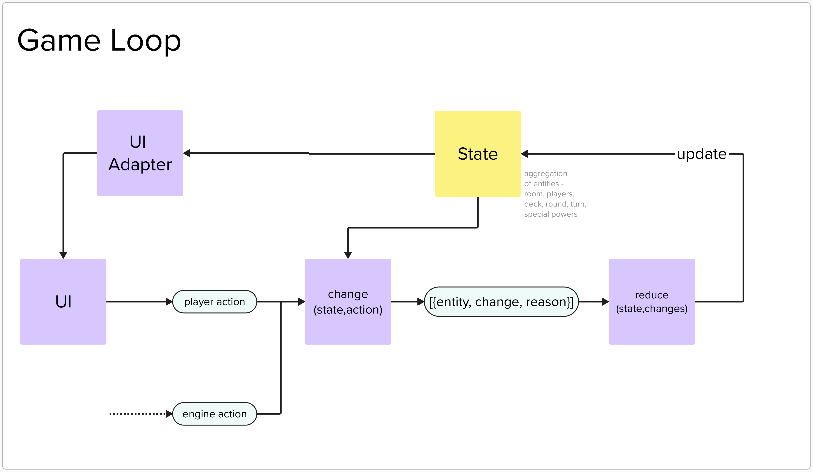

# Architecture

> Show me your flowchart and conceal your tables, and I shall continue to be mystified. Show me your tables, and I won't usually need your flowchart; it'll be obvious. - Fred Brook

There are a few data structures in Viral Spiral. All actions and effects happen by transforming them. Let start with them and rest will folow.

```elixir
    state = %State{
      room: %Room{
        id: "room_abc",
        name: "crazy-house-3213",
        state: :running,
        unjoined_players: [],
        affinities: [:skub, :houseboat],
        communities: [:red, :yellow, :blue],
        chaos: 0,
        chaos_counter: 10,
        volatality: :medium
      },
      players: %{
        "player_abc" => %Player{
          id: "player_abc",
          name: "farah",
          biases: %{yellow: 0, blue: 0},
          affinities: %{skub: 0, houseboat: 0},
          clout: 0,
          identity: :red,
          hand: [],
          active_cards: []
        },
        "player_def" => %Player{
          id: "player_def",
          name: "aman",
          biases: %{red: 0, blue: 0},
          affinities: %{skub: 0, houseboat: 0},
          clout: 0,
          identity: :yellow,
          hand: [],
          active_cards: []
        },
        "player_ghi" => %Player{
          id: "player_ghi",
          name: "krys",
          biases: %{yellow: 0, blue: 0},
          affinities: %{skub: 0, houseboat: 0},
          clout: 0,
          identity: :red,
          hand: [],
          active_cards: []
        },
        "player_jkl" => %Player{
          id: "player_jkl",
          biases: %{yellow: 0, blue: 0},
          affinities: %{skub: 0, houseboat: 0},
          clout: 0,
          name: "adhiraj",
          identity: :red,
          hand: [],
          active_cards: []
        }
      },
      round: %Round{
        order: ["player_jkl", "player_ghi", "player_def", "player_abc"],
        count: 4,
        current: 0,
        skip: nil
      },
      turn: %Turn{
        current: "player_ghi",
        pass_to: ["player_def"],
        path: ["player_abc", "player_jkl"]
      }
    }
```

# Tech Stack


# Game Loop


# Architecture

Each Game Room should be a dynamically supervised GenServer.
So any crashes in one room should be isolated.


# Should all structs be colocated under a Room struct or no?
Colocation makes it easy for developers to see everything in a struct but are the added memory requirements worth it-


# Changes
type : can be any atom

Reserved atoms :
- :ignore : when you want to skip making any changes.

